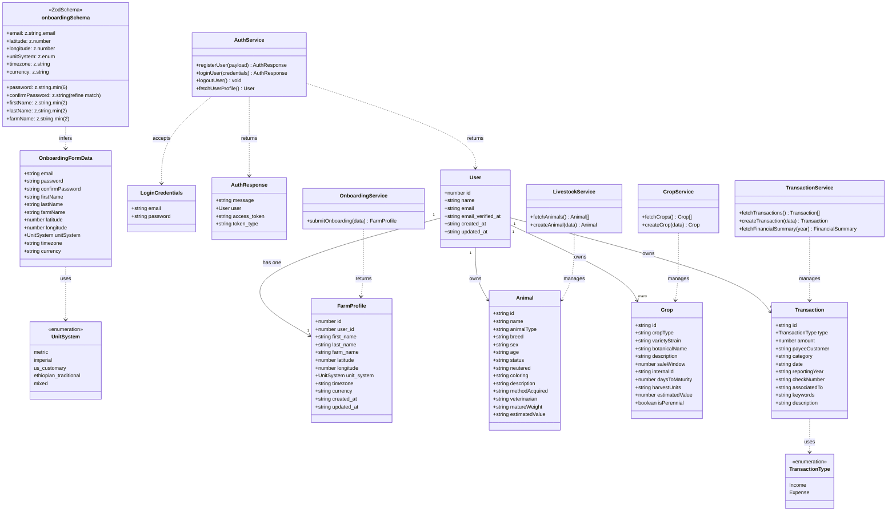

# Farm-ET Frontend Object Model

```mermaid
classDiagram

    %% ─── Auth & Onboarding Form ────────────────────────────────────────────────

    class OnboardingFormData {
        +string email
        +string password
        +string confirmPassword
        +string firstName
        +string lastName
        +string farmName
        +number latitude
        +number longitude
        +UnitSystem unitSystem
        +string timezone
        +string currency
    }

    class UnitSystem {
        <<enumeration>>
        metric
        imperial
        us_customary
        ethiopian_traditional
        mixed
    }

    class LoginCredentials {
        +string email
        +string password
    }

    class AuthResponse {
        +string message
        +User user
        +string access_token
        +string token_type
    }

    %% ─── Domain Types ───────────────────────────────────────────────────────────

    class User {
        +number id
        +string name
        +string email
        +string email_verified_at
        +string created_at
        +string updated_at
    }

    class FarmProfile {
        +number id
        +number user_id
        +string first_name
        +string last_name
        +string farm_name
        +number latitude
        +number longitude
        +UnitSystem unit_system
        +string timezone
        +string currency
        +string created_at
        +string updated_at
    }

    class Animal {
        +string id
        +string name
        +string animalType
        +string breed
        +string sex
        +string age
        +string status
        +string neutered
        +string coloring
        +string description
        +string methodAcquired
        +string veterinarian
        +string matureWeight
        +string estimatedValue
    }

    class Crop {
        +string id
        +string cropType
        +string varietyStrain
        +string botanicalName
        +string description
        +number saleWindow
        +string internalId
        +number daysToMaturity
        +string harvestUnits
        +number estimatedValue
        +boolean isPerennial
    }

    class Transaction {
        +string id
        +TransactionType type
        +number amount
        +string payeeCustomer
        +string category
        +string date
        +string reportingYear
        +string checkNumber
        +string associatedTo
        +string keywords
        +string description
    }

    class TransactionType {
        <<enumeration>>
        Income
        Expense
    }

    %% ─── API Service Layer ──────────────────────────────────────────────────────

    class AuthService {
        +registerUser(payload) AuthResponse
        +loginUser(credentials) AuthResponse
        +logoutUser() void
        +fetchUserProfile() User
    }

    class OnboardingService {
        +submitOnboarding(data) FarmProfile
    }

    class TransactionService {
        +fetchTransactions() Transaction[]
        +createTransaction(data) Transaction
        +fetchFinancialSummary(year) FinancialSummary
    }

    class LivestockService {
        +fetchAnimals() Animal[]
        +createAnimal(data) Animal
    }

    class CropService {
        +fetchCrops() Crop[]
        +createCrop(data) Crop
    }

    %% ─── Validation Schemas (Zod) ───────────────────────────────────────────────

    class onboardingSchema {
        <<ZodSchema>>
        +email: z.string.email
        +password: z.string.min(6)
        +confirmPassword: z.string (refine match)
        +firstName: z.string.min(2)
        +lastName: z.string.min(2)
        +farmName: z.string.min(2)
        +latitude: z.number
        +longitude: z.number
        +unitSystem: z.enum
        +timezone: z.string
        +currency: z.string
    }

    %% ─── Relationships ──────────────────────────────────────────────────────────

    User "1" --> "1" FarmProfile : has one
    User "1" --> "many" Animal    : owns
    User "1" --> "many" Crop      : owns
    User "1" --> "many" Transaction : owns

    OnboardingFormData ..> UnitSystem    : uses
    Transaction        ..> TransactionType : uses

    AuthService        ..> LoginCredentials  : accepts
    AuthService        ..> AuthResponse      : returns
    AuthService        ..> User              : returns
    OnboardingService  ..> FarmProfile       : returns
    TransactionService ..> Transaction       : manages
    LivestockService   ..> Animal            : manages
    CropService        ..> Crop              : manages

    onboardingSchema ..> OnboardingFormData : infers
```
